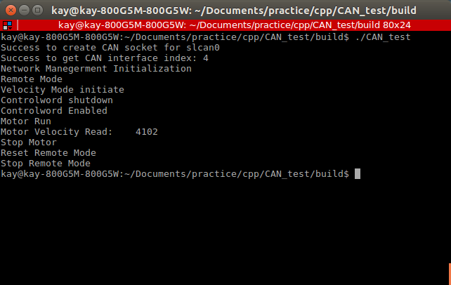

# EPOS2_CAN_TEST_CPP

Control Area Network Communication (CAN)

CAN Velocity data read - refer to candump.c



candump picture


How to save CAN Log
```
candump -l slcan0
```

Abbreviation

1. Process Data Object (PDO)

2. Service Data Object (SDO)

3. Communication Object (COB)

4. Data Length Code (dlc)

Information on COB.
|Object	|COB-ID	    |PDO Mapping
|:---:|:---:|:---:|
|RxPDO1	|0x00000201	|Controlword (dlc = 2)
|RxPDO2	|0x00000301	|Controlword + Modes of Operation (dlc = 3)
|RxPDO3	|0x00000401	|Controlword + TargetVelocity (dlc = 6)
|RxPDO4	|0x00000501	|Controlword + TargetPosition (dlc = 6)
|TxPDO1	|0x00000181	|Statusword (dlc = 2)
|TxPDO2	|0x00000281	|Statusword + Modes of Operation Delay (dlc = 3)
|TxPDO3	|0x00000381	|Statusword + ActualVelocity (dlc = 6)
|TxPDO4	|0x00000481	|Statusword + ActualPosition (dlc = 6)


|Process Data Object|Data type|dlc|
|:---:|:---:|:---:|
|Controlword|Unsigned16| 4 times 4 bits = 2 times 8 bits (dlc = 2)
|Modes of Operation|Unsigned8| 2 times 4 bits = 1 times 8 bits (dlc = 1)
|TargetVelocity|Integer32|8 times 4 bits = 4 times 8 bits (dlc = 4)
|TargetPosition|Integer32|8 times 4 bits = 4 times 8 bits (dlc = 4)
|statusword|Unsigned16| 4 times 4 bits = 2 times 8 bits (dlc = 2)
|Modes of Operation Display|Unsigned8|2 times 4 bits = 1 times 8 bits (dlc = 1)
|ActualVelocity|Integer32|8 times 4 bits = 4 times 8 bits (dlc = 4)
|ActualPosition|Integer32|8 times 4 bits = 4 times 8 bits (dlc = 4)

cpp Code Operation Mode: Velocity Profile Mode

How to compile and execute the code.

```
CAN_TEST $ rm -rf build
```

```
CAN_TEST $ mkdir build
```

```
CAN_TEST/build $ cmake ..
```

```
CAN_TEST/build $ make
```
How to check serial port name

```
dmesg | grep tty
```

Construct CAN frame (Frame name = slcan0)

```
$ sudo slcand -o -c -f -s6 /dev/ttyUSB0 && sudo ifconfig slcan0 up
```

|-s parameter	| Kbit/s
|:---:|:---:|
|-s0|10 Kbit/s
|-s1|20 Kbit/s
|-s2|50 Kbit/s
|-s3|100 Kbit/s
|-s4|125 Kbit/s
|-s5|250 Kbit/s
|-s6|500 Kbit/s
|-s7|800 Kbit/s
|-s8|1000 Kbit/s


Execute the code

```
CAN_TEST/build $ ./CAN_TEST
```

byte_test.cpp

The purpose of the code file is to transmit data to the EPOS2 drive.

The below picture shows how the input data is inserted into the motor drive.


